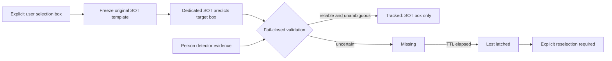

# Persistent SOT identity experiment

## Architecture

The detector never proposes, replaces, corrects, or reinitializes the target. It only validates person presence, SOT agreement, and competitor risk. The immutable selection histogram and immutable neural template are safety evidence; neither is updated. SOT continues internally through short Missing periods, while Lost is terminal within the section.

## Bounded protocol

- Tracker families: 2/2.
- Total configurations: 8/16; no family exceeded 8.
- Refinement passes: 0/1.
- Configurations were ranked on tuning partitions safety-first. One candidate per family was frozen before held-out trajectories were evaluated.
- Frozen annotation hashes and canonical JPEG hashes were verified by the existing benchmark loader; ground truth was not changed.

## Held-out results

- `lighttrack_mobile` tuning: 0/4 safety-eligible; continuity range 38.522%–63.994%. The frozen safety-first diagnostic was tuning-eligible: **False**.
- `nanotrack_v3` tuning: 0/4 safety-eligible; continuity range 50.943%–75.786%. The frozen safety-first diagnostic was tuning-eligible: **False**.

| Candidate | Switches | Wrong | False invisible | Continuity | Delta vs baseline | Courtyard competitor | Accepted |
|---|---:|---:|---:|---:|---:|---:|---|
| Safe baseline | 0 | 0 | 0 | 84.854% | - | 70.000% | reference |
| lighttrack_mobile | 0 | 0 | 0 | 64.372% | -20.482 pp | 69.286% | False |
| nanotrack_v3 | 2 | 23 | 4 | 84.509% | -0.345 pp | 48.571% | False |

### Per-video continuity

| Video | Baseline | LightTrack-Mobile | NanoTrackV3 |
|---|---:|---:|---:|
| single_person | 56.731% | 58.654% | 93.269% |
| multi_person | 100.000% | 77.143% | 74.286% |
| courtyard_single_a | 99.320% | 44.218% | 98.639% |
| courtyard_single_b | 100.000% | 80.000% | 100.000% |
| courtyard_competitor | 70.000% | 69.286% | 48.571% |

## Courtyard competitor: frames 124-160

- `lighttrack_mobile`: 32 Tracked, 5 Missing, 0 Lost; 0 switch(es), 0 wrong frame(s), 86.486% continuity. Wrong indices: none.
- `nanotrack_v3`: 31 Tracked, 6 Missing, 0 Lost; 0 switch(es), 0 wrong frame(s), 83.784% continuity. Wrong indices: none.

During frames 152-160, LightTrack-Mobile suppressed frame 152 for competitor overlap and safely tracked 153-160; NanoTrackV3 suppressed frames 151-152 and safely tracked 153-160. Thus both fixed-template SOTs solve the earlier detector-association failure in this first crossing, but that local success does not generalize.

Across the complete courtyard held-out partition, LightTrack-Mobile stayed identity-safe but fell to 69.286% continuity. NanoTrackV3 later switched to the wrong person for frames 243–264 and fell to 48.571% continuity. Its very high SOT score and permissive frozen-template/detector checks did not establish original identity after the later overlap/separation.

The contact sheet and per-frame traces retain the SOT raw box even when validation suppresses output, making it possible to distinguish tracker takeover from a validation veto. Frames 152-160 are explicitly included; the full courtyard traces also cover the later failure.

## Other required sequences

- `single_person`: LightTrack-Mobile remained safety-clean but reached only 58.654% continuity. NanoTrackV3 reached 93.269% but produced a wrong box at [284] and false tracking while invisible at [251, 253, 285, 286]; it therefore did not handle leave/re-entry safely.
- `multi_person`: continuity was 77.143% for LightTrack-Mobile and 74.286% for NanoTrackV3. Both were identity-safe there, but fail-closed overlap suppression caused material gaps.

## Model cost, licensing, and Android path

| Candidate | Model | Compute | Desktop SOT step | Code | Weights | Android path |
|---|---:|---:|---:|---|---|---|
| lighttrack_mobile | 8.055 MB | 0.53 GFLOPs reported by the CVPR 2021 paper | 174.279 ms mean / 307.985 ms p95 | MIT (official repository LICENSE) | **unclear: checkpoint is committed beside the MIT code but has no explicit model-weight license or provenance terms** | ncnn preferred; ONNX Runtime Mobile possible after a verified export |
| nanotrack_v3 | 2.615 MB | 115.6 MFLOPs reported by the NanoTrack repository | 18.096 ms mean / 58.496 ms p95 | Apache-2.0 (NanoTrack directory LICENSE) | **unclear: ONNX/PyTorch weights have no separate explicit license or provenance grant** | ONNX Runtime Mobile for V3 as-is; ncnn after conversion is the leaner likely prototype path |

- LightTrack-Mobile deployment: Export the frozen template/backbone/head graph, then use ncnn or ONNX Runtime Mobile; LiteRT conversion is unverified. Small enough for the A733 CPU, but latency/thermal behavior must be measured on-device; no inference is made from desktop timing.
- NanoTrackV3 deployment: Use the provided two-part ONNX graph with ONNX Runtime Mobile, or convert/validate NanoTrackV3 with ncnn; only V1 has a supplied ncnn Android demo. The 2.62 MB/115.6 MFLOP graph is the more plausible A733 CPU candidate, but must be benchmarked on the actual tablet.
- LiteRT/TFLite is not a ready path for either supplied artifact: LightTrack first needs a verified static export, while NanoTrackV3 would need ONNX-to-TensorFlow conversion and operator/numerical validation. ONNX Runtime Mobile can consume NanoTrackV3 most directly; ncnn is likely the smallest mobile-native path after converting and validating V3.

The desktop timings exclude the already-cached YOLO detector, whose retained benchmark cost was 104.425 ms mean / 232.676 ms p95. Costs were measured independently, not summed as a mobile estimate, and do not predict Android speed. The P50Ai's Allwinner A733 CPU makes NanoTrackV3 the lighter computational fit, but neither pretrained artifact is deployable in a proprietary app until the weight license is clarified in writing.

Sources: [official LightTrack repository](https://github.com/researchmm/LightTrack), [LightTrack CVPR 2021 paper](https://openaccess.thecvf.com/content/CVPR2021/html/Yan_LightTrack_Finding_Lightweight_Neural_Networks_for_Object_Tracking_via_One-Shot_CVPR_2021_paper.html), [official NanoTrack code/training repository](https://github.com/HonglinChu/SiamTrackers/tree/master/NanoTrack), [NanoTrack Android/ncnn repository](https://github.com/HonglinChu/NanoTrack), [ncnn](https://github.com/Tencent/ncnn), and [Allwinner A733 specification](https://www.allwinnertech.com/uploads/download_source/20260303162657a4.pdf).

## Recommendation

Neither architecture deserves an Android prototype: neither cleared the complete identity-safety and continuity acceptance gate. The missing capability is calibrated long-term target-presence/identity uncertainty that remains reliable after full occlusion or target exit; a fixed-template local SOT response plus person-detector agreement cannot prove that the object after separation is the originally selected person. Independently, both supplied pretrained artifacts are blocked for a proprietary app by unclear weight licensing.

Complete machine-readable configs, metrics, hashes, timing, and sequence summaries are in `result.json`; per-video metrics are in `heldout_metrics.csv`; exact courtyard decisions are in the focused and full trace CSV files for each tracker.
